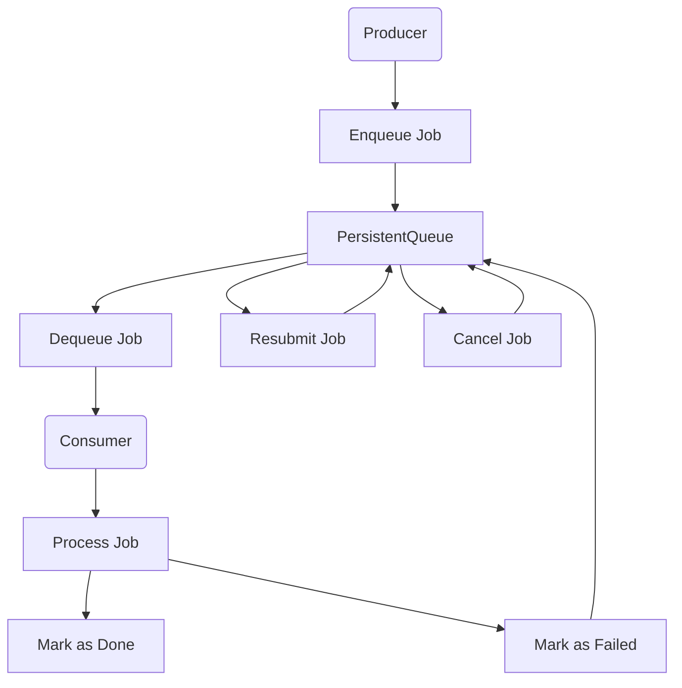

# Persistent Queue System

## 📀 Overview

This project implements a **persistent producer-consumer queue** using SQLite.

It ensures:

- **Job persistence** (jobs survive system restarts).
- **Multiple producers and consumers** can interact with the queue simultaneously.
- **No duplicate processing** (a job is never processed twice).
- **Failure handling** (failed jobs can be retried).

---

## 🎯 **Problem Description**

The system manages jobs that are:
- **Submitted by producers** to the queue.
- **Processed by consumers** in a fault-tolerant manner.
- **Persistently stored in SQLite**, ensuring they **survive restarts**.
- **Not processed by multiple consumers at once** (ensuring reliability).

---

## 🏗 **System Design**
The architecture consists of **4 main components**:

| **Component**   | **Description** |
|---------------|--------------------------------|
| **Producers** | Submit jobs to the queue. |
| **Consumers** | Process jobs from the queue. |
| **Admin Console** | Allows administrators to reprocess failed jobs, cancel pending jobs, and manage queue settings. |
| **Ops Console** | Provides real-time monitoring of job statuses, queue performance metrics, and system health. |

---

## 📊 **Architecture Diagram**




## Usage Instructions

To start the producer, consumer, and consoles, run the following commands:

```bash
# Start Producer
poetry run python -m persistent_queue_system.producer

# Start Consumer
poetry run python -m persistent_queue_system.consumer

# Start the Admin Console (Streamlit)
poetry run streamlit run persistent_queue_system/admin.py

# Start the Ops Console (Streamlit)
poetry run streamlit run persistent_queue_system/ops.py

```


## Features
- **Producers** submit jobs to the queue.
- **Consumers** process jobs.
- **Persistent Storage**: Jobs survive restarts.
- **Admin Console**: Manage job reprocessing.
- **Ops Console**: View job statuses.
- **Supervisor** for process management

## Installation

Ensure Poetry is installed, then set up the project:

```bash
git clone <repo-url>
cd persistent_queue_system
poetry install


## Process Management (Supervisor)

To ensure continuous execution of producers and consumers, Supervisor is used.

Start Supervisor

sudo supervisord -c supervisor/supervisord.conf

Check Process Status

sudo supervisorctl -c supervisor/supervisord.conf status

Restart a Process

sudo supervisorctl -c supervisor/supervisord.conf restart producer

