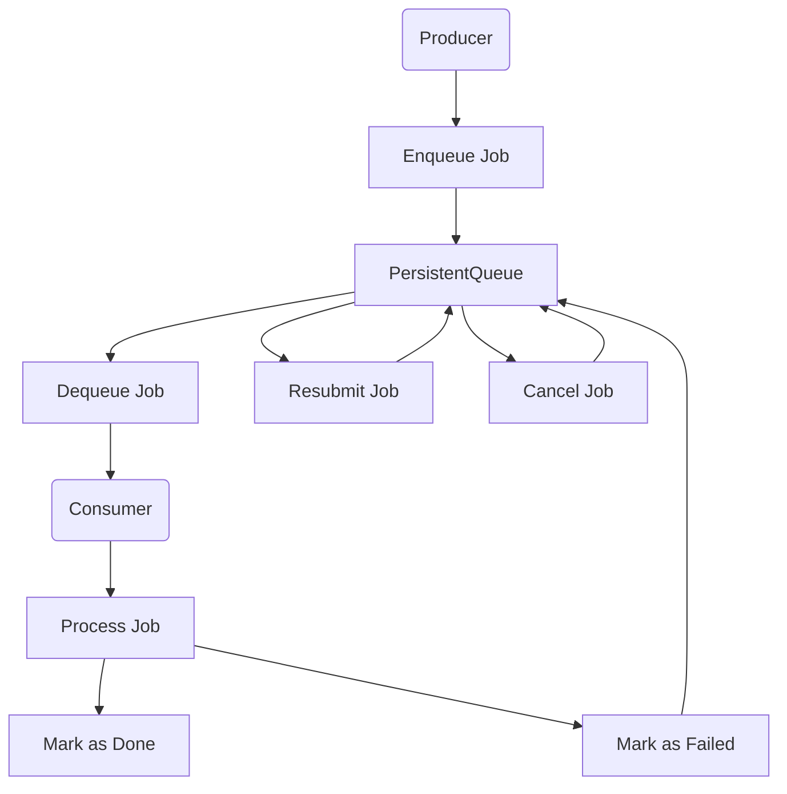
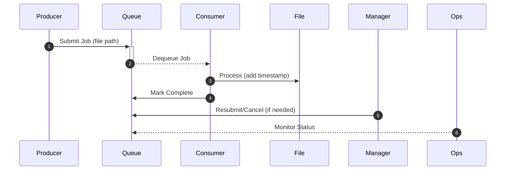

# Persistent Queue System Documentation

## Problem Understanding

The Persistent Queue System addresses the following challenges:

- **Persistence:** Ensuring jobs survive system restarts
- **Concurrency:** Allowing multiple producers and consumers to interact with the queue simultaneously
- **Reliability:** Preventing duplicate processing of jobs
- **Failure Handling:** Automatic retries for failed jobs

## Approach & Methodology

The system uses SQLite for persistent storage and implements a producer-consumer model with:

- Multiple producers submitting jobs
- Multiple consumers processing jobs
- Admin and Ops consoles for management and monitoring
- Supervisor for process management

## System Design

### Architecture Diagram:



### Explanation of the Flowchart

The flowchart illustrates the core components and their relationships in the Persistent Queue System:

- **Producer to Queue:** Producers create and enqueue jobs into the persistent queue
- **Queue to Consumer:** Consumers dequeue jobs from the queue for processing
- **Processing Outcomes:** After processing, jobs are either marked as done or failed
- **Job Management:** Failed jobs can be resubmitted or cancelled through the queue
- **Feedback Loop:** The system maintains a complete feedback loop to ensure all jobs reach their final state

This architecture ensures jobs remain in the system until they are successfully processed or explicitly cancelled, providing reliability and resilience.

## Sequence Diagram

The **sequence diagram** highlights step-by-step interactions among the main components:

### Component Interactions:



### Explanation of the Sequence Diagram

1. **Producer** sends a new job (e.g., a file path) to the **Queue**.
2. **Queue** then provides the job to an available **Consumer** (when the consumer dequeues).
3. **Consumer** modifies the **File** (e.g., appending timestamps).
4. **Consumer** informs the **Queue** when the job is complete (status becomes `done`).
5. **Manager** (or Admin Console) can instruct the **Queue** to **resubmit** or **cancel** jobs if needed.
6. **Ops** (Ops Console) queries the **Queue** for real-time job statuses.

## Usage Instructions

### Start Components:

```
# Start Producer
poetry run python -m persistent_queue_system.producer

# Start Consumer
poetry run python -m persistent_queue_system.consumer

# Start Admin Console
poetry run streamlit run persistent_queue_system/admin.py

# Start Ops Console
poetry run streamlit run persistent_queue_system/ops.py
```

## Features

- **Persistent Storage**: Jobs are stored in SQLite and survive system restarts
- **Concurrency**: Supports multiple producers and consumers
- **Management Interfaces**: Admin and Ops consoles for monitoring and control

## LLMs Used

- **GPT-4**: Used for initial problem analysis and solution design
- **Claude 3**: Used for code generation and optimization

## Design Decisions

1. Why Choose SQLite for Persistence?

Durability:
SQLite writes changes immediately to a file on disk. This means that once a job is enqueued, it’s stored on disk and remains there even if the process or system restarts. This inherent persistence makes SQLite a strong candidate for ensuring no job is lost.

Ease of Management:
SQLite is self-contained and doesn’t require a separate server process. Its file-based nature means you don’t have to manage complex configurations, and there’s little overhead in terms of setup and maintenance compared to more heavyweight database systems.

ACID Compliance:
SQLite guarantees atomicity, consistency, isolation, and durability. Each operation (like enqueueing or dequeuing a job) is executed as a transaction, ensuring that even if a failure occurs mid-operation, the database remains in a consistent state.

Scalability:
While SQLite is excellent for moderate workloads and is well-suited for many small- to medium-scale applications, it does have limitations with very high concurrency or extremely large datasets. For your project—a persistent queue system with moderate throughput—it provides a good balance between simplicity and performance. However, if your message volume grows substantially, you might eventually consider more robust solutions.

Portability:
Being file-based, SQLite is highly portable. The entire database is contained within a single file, making it easy to move or deploy across different environments without complex configuration. This simplicity greatly eases deployment and maintenance.

2. Why Use Supervisor for Process Management?

Automatic Recovery:
Supervisor monitors your processes (such as producers and consumers) and automatically restarts any process that crashes. This means that if a consumer dies unexpectedly, Supervisor will restart it, helping to keep the system running continuously.

Process Control:
With Supervisor, you have a centralized way to start, stop, restart, and monitor multiple processes. This makes it very easy to manage the lifecycle of all your application components, ensuring that each part of your system is operating as expected.

Logging:
Supervisor captures standard output (stdout) and error output (stderr) of your processes into log files. These logs simplify troubleshooting and debugging because you have a historical record of what each process was doing and why it might have crashed.

Resource Efficiency:
Supervisor is lightweight and designed for process management. It introduces minimal overhead while providing powerful monitoring and control features, ensuring that your system performance isn’t significantly impacted.

Configuration:
Supervisor’s configuration is straightforward and highly customizable. You can easily tailor it to suit your project’s needs—defining multiple instances of your producers and consumers, setting automatic restarts, and specifying log file locations—all within a simple configuration file.

3. Logging & Debugging Strategies

Producer Logs:
Producer logs capture every job that is submitted to the queue. They are useful for verifying that jobs are being created as expected and for identifying any bottlenecks in job generation.

Consumer Logs:
Consumer logs provide insights into job processing. They can help you detect errors during processing, see how long jobs are taking, and identify if certain jobs are causing failures.

Supervisor Logs:
Supervisor logs (both stdout and stderr) are essential for monitoring the overall health of your processes. They help diagnose crashes or repeated restarts and provide a centralized location for troubleshooting.

4. Additional Design Decisions

Concurrency Handling:
The system uses SQLite’s built-in locking mechanisms to handle concurrent access. Multiple producers can enqueue jobs concurrently, and when a consumer dequeues a job, the system updates its status immediately to prevent other consumers from processing it. This helps avoid race conditions.

Message Prioritization:
Currently, jobs are processed in a FIFO (first in, first out) manner based on their creation time. If message prioritization becomes necessary, you could extend the database schema to include a priority column and adjust the dequeue query accordingly.

Error Handling:
The system uses transactional operations (ACID transactions) in SQLite to ensure that jobs are either fully processed or not processed at all. Additionally, failed jobs can be retried a set number of times before being marked as permanently failed. This helps recover from transient errors.

Backup and Recovery:
Since SQLite is file-based, backing up the entire queue is as simple as copying the database file. You can implement automated backup routines (e.g., using cron jobs) to periodically save a copy of the database file.

Security:
SQLite databases can be secured using file system permissions. Ensure that the database file is stored in a secure directory and that only authorized users have access. For more advanced security needs, consider encryption options.

Testing:
The system is tested by simulating multiple producers and consumers and verifying that jobs are processed correctly even under failure conditions. Unit tests and integration tests can be written to simulate consumer crashes, database locks, and concurrent access.

Extensibility:
The design is modular, making it easy to extend. For instance, if you need to add new features such as additional job types or integrate with other systems, you can modify or add new modules without significant changes to the core architecture.

Performance Metrics:
You can track metrics such as the number of jobs processed per minute, average processing time, job failure rates, and queue length. These metrics can help you understand the system's performance and identify bottlenecks.

Documentation:
The project is documented with clear, concise explanations of the system design, usage instructions, and configuration details. Future developers can refer to this documentation for easy maintenance and further development.

Compatibility:
SQLite’s file-based nature and the use of Python (with packages like Poetry) ensure that the system is highly portable and compatible across different operating systems and environments (e.g., Windows, Linux, macOS).

5. Who handles job resubmission?

The Manager component is designed to automatically detect jobs that have been “processing” for too long (which may indicate a consumer crash) and then resubmit them by re-adding them to the queue. Additionally, the Admin Console allows an administrator to manually trigger resubmission if needed.

6. How do you know if a consumer dies?

The system uses a timeout-based approach. When a job is marked as “processing,” a timestamp is recorded. If a job remains in that state for longer than a predefined threshold, it is assumed that the consumer handling that job has died, triggering the resubmission process.

7. How does the system support multiple producers and consumers?

All producers and consumers connect to the same SQLite database. When a producer submits a job, it gets added to the shared queue. When a consumer dequeues a job, the system marks it as “processing” immediately to prevent other consumers from taking it. This coordinated access ensures each job is processed only once, even when multiple processes are running concurrently.

8. What happens if a producer crashes while submitting a job?

If a producer crashes while submitting a job, the job will be partially inserted into the database.

9. How does the system handle job failures?

Automatic Retry & Failure Counting:
When a job is picked up by a consumer and an error occurs during processing, the system increments an attempt counter for that job. If the job fails repeatedly—exceeding a predefined maximum number of attempts—it is then marked as "failed" so that it won’t be retried indefinitely.

Stale Job Detection:
If a consumer crashes or becomes unresponsive after picking up a job, the job remains in a "processing" state. A background process or Manager periodically checks for jobs that have been in "processing" for too long. If a job exceeds this threshold, it is considered stale and is automatically resubmitted (i.e., its status is reset to "pending") so that another consumer can try processing it.

Manual Intervention:
Administrators can also use the Admin Console to manually review jobs that are stuck or have failed. They have the option to resubmit or cancel these jobs based on the situation.

10. How are logs managed in the system?

Each component (producer, consumer, etc.) writes its logs to separate files, and Supervisor collects these logs. This centralized logging helps in tracking what happens during job submission, processing, and any failures, making debugging and monitoring much easier.


## Prompts & Answers

**Q1: What is the purpose of the Persistent Queue System?**  
The system manages asynchronous job processing with persistence, ensuring jobs survive system restarts and are processed reliably.

**Q2: How does the system prevent duplicate processing?**  
It uses SQLite's transaction capabilities to ensure each job is marked as 'processing' before being handled, preventing multiple consumers from processing the same job.

**Q3: What happens when a job fails?**  
Failed jobs are retried up to a maximum number of attempts before being marked as permanently failed in the system.

**Q4: How does the Admin Console help manage the system?**  
The Admin Console allows administrators to view job statuses, reprocess failed jobs, and cancel pending jobs as needed.

**Q5: What is the role of Supervisor in this system?**  
Supervisor ensures continuous operation by automatically restarting producer and consumer processes if they crash.

**Q6: How does the system handle concurrent access?**  
SQLite's write-ahead logging (WAL) mode enables multiple producers and consumers to interact with the queue simultaneously while maintaining data integrity.