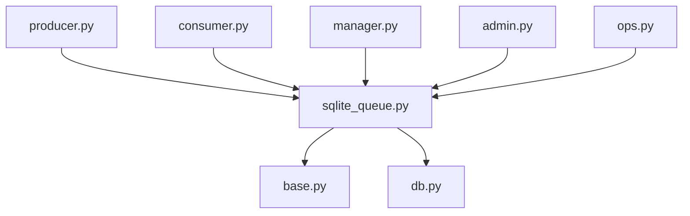
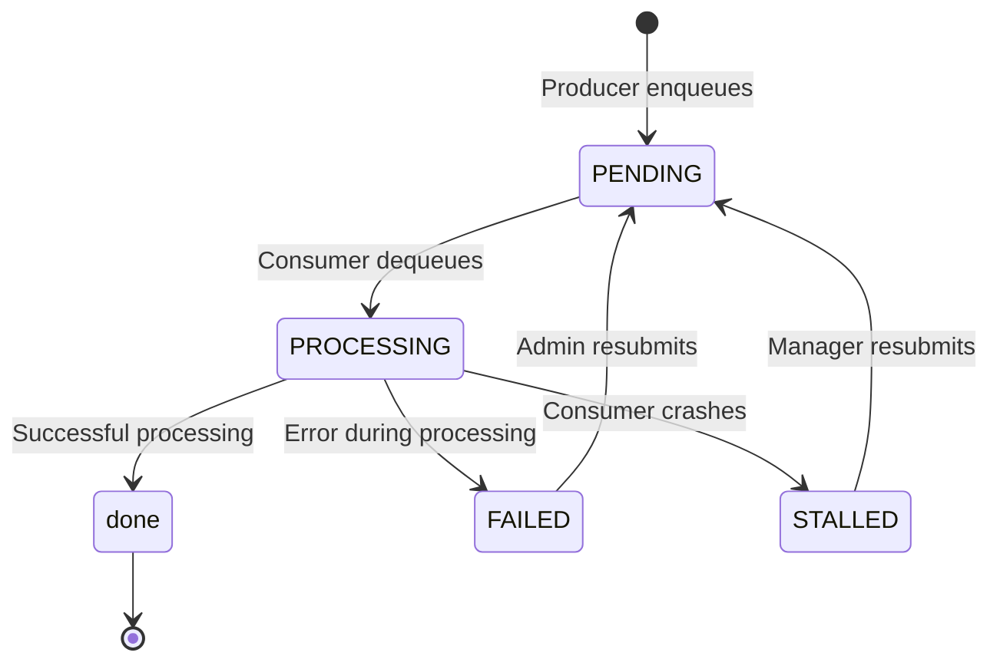
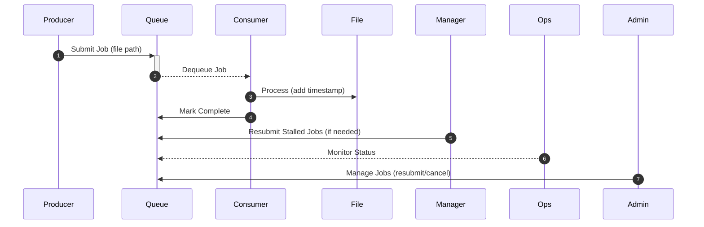

# Persistent Queue System - Development Notes

## Core Problem & Objectives

The Persistent Queue System addresses several critical challenges in distributed job processing:

- **Persistence:** Ensuring all jobs survive system crashes and restarts
- **Concurrency:** Supporting multiple producers and consumers working simultaneously
- **Reliability:** Preventing duplicate processing of the same job
- **Fault Tolerance:** Automatically handling failures at every level

## System Architecture

### Key Components

1. **Producers:** 
- **Role:** Generate jobs by creating files every 5 seconds, and submit them to the queue.
- **Operation:** 
   - Enqueues the file paths as jobs in the persistent SQLite queue.
   - Create files every 5 seconds
- **Implementation:** Utilizes the `queue` module to interact with the SQLite database.
- **Example:** `producer.py` demonstrates how to create a producer that generates jobs and submits them to the queue.

2. **Consumers:** 
- **Role:** Process jobs from the queue.
- **Operation:**
   - Wait for a randomized delay (7-15 seconds) before marking the job as **done**.
   - Append timestamps to the job file.
   - Update job status upon completion or failure
- **Implementation:** Utilizes the `queue` module to interact with the SQLite database.
- **Example:** `consumer.py` demonstrates how to create a consumer that processes jobs from the queue


3. **Persistent Queue (SQLite):**
- **Role:** Stores jobs persistently across system restarts.
- **Operation:**
   - Maintains job status, attempts, timestamps, and error messages.
   - Implements atomic operations for safe enqueueing and dequeuing.
- **Implementation:** Utilizes the `sqlite3` module for database operations.
- **Example:** `sqlite_queue.py` demonstrates how to create a persistent queue using SQLite.

4. **Manager:**
- **Role:** Orchestrates the system, ensuring persistence and reliability (Monitor and recover jobs.).
- **Operation:**
   - Monitors the queue for new jobs and updates job status upon completion or failure.
   - Monitors job health every 5 minutes.
   - Resubmits jobs that have been in the `processing` state for more than 1 hour.
   - Ensures recovery from consumer crashes
   - Updates job statuses to allow further processing.
- **Implementation:** Utilizes the `queue` and `sqlite3` modules for interacting with
   the queue and database.
- **Example:** `manager.py` demonstrates how to create a manager that oversees the system's

5. **Admin Console:**
- **Role:** Provides a user interface for management actions, monitoring and controlling the system.
- **Operation:**
- Built with Streamlit.
- Displays job statistics (status, attempts, and timestamps).
- Allows users to manually mark jobs as done or failed.
- Allows administrators to resubmit or cancel jobs.
- Provides a way to view job history and statistics.
- **Implementation:** Utilizes the `streamlit` module for creating the admin console.
- **Example:** `admin_console.py` demonstrates how to create an admin console using Streamlit.

6. **Ops Console:**
- **Role:** Provides a user interface for real-time monitoring and controlling the system.
- **Operation:**
- Built with Streamlit.
- Displays system statistics (queue size, job count, and consumer status).
- Allows users to manually mark jobs as done or failed.
- Allows administrators to resubmit or cancel jobs.
- Provides a way to view job history and statistics.
- **Implementation:** Utilizes the `streamlit` module for creating the ops console.
- **Example:** `ops_console.py` demonstrates how to create an ops console using Streamlit.


## 📊 Architecture Diagram

```mermaid
flowchart TB
    subgraph P[Producer<br/>(producer.py)]
        A[Generate Job File]
    end
    subgraph Q[SQLite Queue<br/>(PersistentQSQLite)]
        B[Jobs Table]
    end
    subgraph C[Consumer<br/>(consumer.py)]
        D[Process Job<br/>(append timestamp)]
    end
    subgraph M[Manager<br/>(manager.py)]
        E[Monitor & Resubmit Stalled Jobs]
    end
    subgraph Admin[Admin Console<br/>(admin.py)]
        F[Job Management & Stats]
    end
    subgraph Ops[Ops Console<br/>(ops.py)]
        G[Real-time Monitoring]
    end

    A -->|Enqueue job file path| B
    B -->|Atomic Dequeue| D
    D -->|Mark as done| B
    B -->|Provide job metrics| E
    E -->|Resubmit stalled jobs| B
    B --> F
    B --> G
```

Explanation:

- Producer to Queue: Files are generated and their paths enqueued.
- Queue to Consumer: Jobs are dequeued with an atomic lock to ensure exclusive processing.
- Consumer Processing: The consumer appends processing metadata and updates the job to done.
- Manager Intervention: The manager monitors and resubmits stalled jobs.
- Consoles: Both admin and ops consoles retrieve real-time metrics from the queue.
- Ops Console: Displays system statistics and allows manual job management.
- Admin Console: Provides job management and statistics for administrators.

---


## 🔄 Job Retry Flow Diagram

This diagram illustrates the detailed flow when a job fails during processing and how it is handled (retried or marked as permanently failed):

```mermaid
flowchart TD
    A[Job Enqueued (pending)] --> B[Dequeued for Processing (processing)]
    B --> C{Processing Outcome?}
    C -- Success --> D[Mark as done]
    C -- Failure --> E[Increment Attempt Count]
    E --> F{Attempts < Max?}
    F -- Yes --> G[Requeue Job (pending)]
    F -- No --> H[Mark as permanently_failed]
```
Explanation:
- A → B: A job moves from the pending queue to processing.
- B → C: The consumer processes the job.
- Success Path: If processing is successful, the job is marked as done.
- Failure Path: If processing fails, the attempt counter is incremented.
- F → G/H: Depending on the number of attempts, the job is either requeued for another try or marked as permanently failed.


- Job Enqueued: The job is initially in a pending state.
- Dequeued for Processing: The job is dequeued and begins processing.
- Processing Outcome: The job's processing outcome is determined.
- Success: If the job is successful, it is marked as done.
- Failure: If the job fails, its attempt count is incremented.
- Attempts < Max: If the job's attempt count is less than the maximum allowed, it is requeued for further attempts.
- Attempts >= Max: If the job's attempt count reaches the maximum, it is marked as permanently
failed.


---

## 🧩 Module Dependency Diagram

This diagram shows the dependency relationships among the core modules of my project:


Explanation:

- Modules like producer.py, consumer.py, manager.py, admin.py, and ops.py depend on the sqlite_queue.py implementation.
- The sqlite_queue.py module, in turn, relies on the abstract interface from base.py and the database connection managed by db.py.


- producer.py: This module is responsible for producing jobs and placing them in the queue.
- sqlite_queue.py: This module manages the SQLite database used for storing and retrieving jobs.
- consumer.py: This module is responsible for dequeuing jobs from the queue and processing them.
- manager.py: This module manages the overall workflow of the system, including job processing and retries.
- admin.py: This module provides administrative functionality, such as viewing job statistics and managing the queue.
- ops.py: This module contains utility functions for performing operations on the queue and jobs.
- base.py: This module provides a base class for queue-related functionality.
- db.py: This module contains database-related functionality for interacting with the SQLite database.


---


## Job Lifecycle State Diagram



## Sequence Diagram

The sequence diagram illustrates the detailed interactions between components:



1. **Producer** submits a new job (file path) to the **Queue**
2. **Consumer** dequeues an available job from the **Queue**
3. **Consumer** processes the **File** (appending timestamps)
4. **Consumer** marks the job as complete in the **Queue**
5. **Manager** periodically checks for and resubmits stalled jobs
6. **Ops Console** monitors queue status and metrics
7. **Admin Console** provides job management capabilities

## Technical Design Decisions

### 1. Why SQLite for Persistence?

- **ACID Compliance:** Guarantees atomicity, consistency, isolation, and durability
- **Self-Contained:** No external database server required
- **File-Based Design:** Simplifies backup and recovery procedures
- **Transactional Support:** Prevents data corruption during concurrent operations
- **Widespread Adoption:** Well-tested in production environments

SQLite's write-ahead logging (WAL) mode specifically enables multiple producers and consumers to interact with the queue simultaneously while maintaining data integrity.

### 2. Supervisor for Process Management

- **Automatic Recovery:** Immediately restarts crashed processes
- **Centralized Control:** Streamlines starting, stopping, and monitoring components
- **Comprehensive Logging:** Captures stdout/stderr for troubleshooting
- **Resource Efficiency:** Minimal overhead for maximum monitoring benefit
- **Flexible Configuration:** Easily scales number of producers/consumers

### 3. Concurrency Handling

- **Transactional Dequeuing:** Uses SQLite's locking to prevent race conditions
- **Atomic Status Updates:** Ensures jobs can't be processed by multiple consumers
- **FIFO Processing:** Jobs are handled in submission order by default
- **Scalable Consumer Model:** Add more consumers to increase throughput

### 4. Crash Recovery Mechanisms

#### Producer Crashes
- SQLite transactions ensure jobs are either fully inserted or not at all
- No partial job data can corrupt the system

#### Consumer Crashes
- Manager component periodically checks for stalled jobs
- Jobs in PROCESSING state for over 1 hour are automatically resubmitted
- Another consumer can then complete the abandoned job

#### System-Wide Crashes
- All job data persists in SQLite database
- Processing resumes from last state after restart
- No manual intervention required

### 5. Logging & Monitoring

- **Component-Specific Logs:** Separate log files for producers, consumers, and manager
- **Centralized Collection:** Supervisor aggregates logs for comprehensive viewing
- **Real-Time Monitoring:** Ops Console provides current system status
- **Performance Metrics:** Track throughput, processing times, and failure rates
- **Historical Data:** Maintain job processing history for analysis

---

### Error Handling Architecture

1. **Multi-Layer Retry System:**
   - **Immediate Retry:** Consumer attempts 3 immediate retries for transient errors
   - **Delayed Retry:** Manager reschedules failed jobs with exponential backoff
   - **Manual Retry:** Admin console allows forced retry of specific failures

2. **Dead Letter Queue Implementation:**
   ```mermaid
   flowchart LR
       FailedJob[Failed Job] -->|Max Retries Exceeded| DLQ[Dead Letter Queue]
       DLQ -->|Inspection| AdminConsole[Admin Console]
       AdminConsole -->|Resubmit| MainQueue[Main Queue]
   ```

3. **Transactional Integrity:**

   - All database operations use SQLite transactions
   - WAL (Write-Ahead Logging) mode prevents data corruption
   - Automatic rollback on consumer process termination

4. **Alert System Integration:**

   - Configure SMTP settings in config.py for email alerts
   - Critical failures trigger Slack/webhook notifications

---


## Implementation Notes

### Key Database Schema

The SQLite database contains a primary `jobs` table with:

- `id`: Unique job identifier
- `data`: Job payload (typically a file path)
- `status`: Current state (PENDING, PROCESSING, COMPLETED, FAILED)
- `created_at`: Timestamp when job was created
- `updated_at`: Timestamp of last status change
- `attempts`: Number of processing attempts
- `error`: Error message if job failed
- `consumer_id`: Identifier of consumer processing the job

### Extensibility Considerations

- **Abstract Interface:** `PersistentQInterface` allows alternative implementations
- **Pluggable Backends:** Can swap SQLite for Redis, PostgreSQL, etc.
- **Component Separation:** Clear boundaries between queue logic and processing


---


## Usage Instructions

### Starting the System with Supervisor

```bash
# Start all components
poetry run supervisord -c supervisord.conf

# Check status
supervisorctl status

# Restart components
supervisorctl restart queue-producer
supervisorctl restart queue-consumer
```

### Accessing Management Interfaces

```bash
# Admin Console
poetry run streamlit run persistent_queue_system/admin.py
# Available at http://localhost:8501

# Ops Console
poetry run streamlit run persistent_queue_system/ops.py
# Available at http://localhost:8502
```

### Starting Components Individually (Development)

```bash
# Start Producer
poetry run python -m persistent_queue_system.producer

# Start Consumer
poetry run python -m persistent_queue_system.consumer

# Start Manager
poetry run python -m persistent_queue_system.manager
```

## Troubleshooting Guide

### Common Issues & Solutions

1. **Stalled Jobs:** Check manager logs to verify it's running and monitoring correctly
2. **Database Locks:** Ensure proper transaction handling in custom code
3. **Process Crashes:** Review Supervisor logs for error details
4. **Performance Bottlenecks:** Monitor queue depth and processing times

### Diagnostic Commands

```bash
# Check component logs
tail -f logs/producer.log
tail -f logs/consumer.log
tail -f logs/manager.log

# Verify database integrity
sqlite3 queue.db "PRAGMA integrity_check;"

# Run test suite
poetry run pytest tests/
```

## Performance Optimization

- **Consumer Scaling:** Adjust number of consumers based on workload
- **Database Indexing:** Ensure proper indices for status and timestamp columns
- **Regular Maintenance:** Implement periodic cleanup of completed jobs
- **Batch Processing:** Consider batch operations for high-throughput scenarios


## FAQ

1. **What happens if a consumer crashes while processing a job?**
   - The job remains in PROCESSING state
   - Manager identifies it as stalled after 1 hour
   - Job is automatically resubmitted for processing by another consumer

2. **How do you prevent duplicate processing?**
   - SQLite transactions ensure atomic status updates
   - When a consumer dequeues a job, its status changes to PROCESSING
   - Database locks prevent concurrent dequeuing of the same job

3. **How does the system recover from a complete restart?**
   - All job data persists in SQLite database
   - Upon restart, PENDING jobs resume processing normally
   - Manager resubmits any stalled PROCESSING jobs

4. **How do you scale the system for higher throughput?**
   - Add more consumer processes via Supervisor configuration
   - Optimize database with appropriate indices
   - Consider moving to a more scalable backend for extremely high volumes


## Future Enhancements & Ideas
- **Priority Scheduling:** Improve the priority mechanism to support more complex scheduling.
- **Additional Backends:** Implement alternative queue backends like Redis or PostgreSQL.
- **Enhanced Metrics:** Integrate detailed monitoring tools (e.g., Prometheus, Grafana).
- **Improved Recovery Strategies:** Adapt the retry logic with dynamic backoff strategies.
- **Scheduled Job Execution:** Add functionality to schedule jobs for future execution.
- **Dynamic Configuration:** Allow runtime configuration of parameters such as retry limits and processing time thresholds.
- **Enhanced Security:** Implement authentication and authorization mechanisms to secure the system.
- **Integration with External Services:** Integrate with external services like email, messaging, or cloud storage for better access.
- **Advanced Job Management:** Introduce features like job cancellation, pause, and resume.
- **Support for Multiple Queue Types:** Allow the system to handle different types of queues.
- **Enhanced Error Handling:** Implement more sophisticated error handling mechanisms to handle complex error scenarios.
- **Support for Distributed Queues:** Scale the system to handle large volumes of jobs by distributing the queue.
- **Improved Performance:** Optimize the system for better performance by reducing database queries and improving data access patterns.
- **Support for Multiple Job Types:** Allow the system to handle different types of jobs.
- **Improved User Experience:** Enhance the user interface to provide better insights into job processing and system performance.

## Additional Notes
- Deployment & Configuration:
The project uses Supervisor for process management. Check supervisord.conf for settings like the HTTP socket location, which may need adjustment based on your environment.

- Code Modularity:
The system is designed to be modular, making it easy to extend or modify specific components without impacting the overall architecture.


