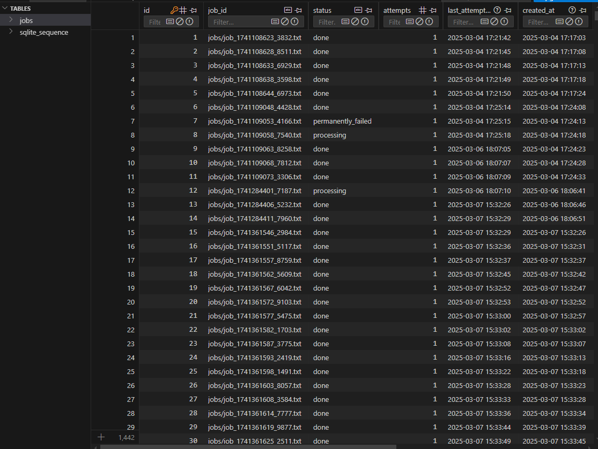

---

##### Persistent Queue System

###### Overview
Welcome to the Persistent Queue System! This is a robust job queue management system designed to handle tasks efficiently and reliably, ensuring that no task is lost even if the system experiences failures or crashes. It supports multiple producers submitting jobs and multiple consumers processing them, with monitoring and management capabilities through Streamlit-based consoles.

###### What You Need
- A computer with Python 3.10 or higher installed.
- Basic knowledge of using the command line.

###### Setting Up the Project
- **Step 1: Open Your Terminal**  
  Open your terminal or command prompt.
- **Step 2: Navigate to the Project Folder**  
  Assuming the project is cloned or downloaded, navigate to it:  
  ```bash
  cd persistent-queue-system
  ```
- **Step 3: Install Dependencies**  
  Install the project dependencies using Poetry:  
  ```bash
  poetry install
  ```
- **Step 4: Create Necessary Folders**  
  Create the required directories for jobs and logs:  
  ```bash
  mkdir -p jobs logs && chmod 777 jobs logs
  ```

###### Running the Application
- **Starting with Supervisor (Recommended)**  
  Start the Supervisor to manage all processes:  
  ```bash
  sudo supervisord -c /etc/supervisor/supervisord.conf 
  ```
- **Accessing the Consoles**  
  1. **Admin Console** (Management Interface):  
     ```bash
     poetry run streamlit run persistent_queue_system/admin.py --server.port=8501
     ```
     Access at: [http://localhost:8501](http://localhost:8501)  

  2. **Ops Console** (Monitoring Interface):  
     ```bash
     poetry run streamlit run persistent_queue_system/ops.py --server.port=8502
     ```
     Access at: [http://localhost:8502](http://localhost:8502)
     - **Stopping the Application**
     To stop the application, simply close the Streamlit consoles or use the Supervisor to stop the processes
     - **Restarting the Application**
     To restart the application, use the Supervisor to restart the processes or close and reopen the Streamlit

- **Starting Components Individually (For Development)**  
  ```bash
  # Start Producer
  poetry run python -m persistent_queue_system.producer
  
  # Start Consumer
  poetry run python -m persistent_queue_system.consumer
  
  # Start the Manager
  poetry run python -m persistent_queue_system.manager
  ```
  - **Stopping the Application**
  To stop the application, you can use the following commands:
  ```bash
  # Stop Supervisor
  supervisorctl -c supervisord.conf stop all
  supervisorctl -c supervisord.conf shutdown
  ```

---

queue.db:




---

Admin Console:


---

Ops Console:


---

## 🏗 System Design

The architecture consists of **5 main components**:

| **Component**                 | **Description**                                                                                                                                           |
|-------------------------------|-----------------------------------------------------------------------------------------------------------------------------------------------------------|
| **Producer (producer.py)**    | Generates job files in the `jobs` directory and enqueues their file paths into the SQLite-based persistent queue every 5 seconds.                          |
| **Consumer (consumer.py)**    | Dequeues jobs from the SQLite queue, processes the files by appending timestamps (with a randomized delay between 7 to 15 seconds), and marks them as `done`. |
| **Manager (manager.py)**      | Periodically (every 5 minutes) monitors job health. It resubmits jobs stuck in the `processing` state (over 1 hour old) and handles retries.             |
| **Admin Console (admin.py)**  | A Streamlit-based interface that displays job statistics, allows filtering by status, and enables manual actions (resubmit, mark as failed, or cancel).   |
| **Ops Console (ops.py)**      | A read-only Streamlit dashboard providing real-time monitoring of active jobs and overall system performance metrics.                                     |

---

## 📊 Architecture Diagram


- Explanation of the Architecture Diagram:
  Producer to Queue: The producer creates job files and enqueues their file paths. 
  Queue to Consumer: The SQLite queue uses atomic operations to dequeue a pending job for processing.
  Processing: The consumer processes the job (adding timestamps) and updates the job status to done.
  Manager Intervention: The manager periodically checks job health and resubmits jobs that have been stuck in processing for more than 1 hour.
  Consoles: Both the Admin and Ops consoles pull job metrics from the SQLite queue, with the Admin Console also allowing manual intervention.

---

🔁 Sequence Diagram


- Explanation of the Sequence Diagram:
  Job Submission: The Producer enqueues a new job by writing a file and sending its path to the queue.
  Job Retrieval: The Queue atomically dequeues the job for processing.
  Job Processing: The Consumer processes the job by appending processing details to the file and then updates the job status to `done`.
  Health Monitoring: The Manager routinely checks for jobs in `processing` that exceed the 1-hour threshold and resubmits them.
  Monitoring & Administration: The Admin Console and Ops Console retrieve job statistics and metrics for real-time management and monitoring.

---

⚙️ Job Lifecycle Diagram


*Note:* `STALLED` is a logical state detected by the Manager, not a database state.

- Explanation of the Job Lifecycle Diagram:
  PENDING: Jobs enter the queue when enqueued by the Producer.
  PROCESSING: The Consumer dequeues a job and marks it as processing.
  done: Successfully processed jobs are marked as done.
  FAILED: Jobs that encounter errors are marked as failed and can be retried.
  STALLED: If a job remains in processing too long (e.g., due to a crash), it is flagged as stalled and then resubmitted by the Manager.
  Feedback Loop: Jobs that are failed or stalled are re-enqueued, ensuring every job eventually reaches a terminal state.


###### Process Management with Supervisor
Check process status:  
```bash
supervisorctl -c supervisord.conf status
```

Restart specific components:  
```bash
supervisorctl -c supervisord.conf restart queue-producer
supervisorctl -c supervisord.conf restart queue-consumer
```

Stop all components:  
```bash
supervisorctl -c supervisord.conf stop all
```
*Note:* Supervisor auto-restarts crashed processes due to `autorestart=true` in `supervisord.conf`.

###### How It Works
The system consists of several components:
- **Producers**: Continuously generate job files every 5 seconds in the jobs directory. Each file is enqueued as a job in the persistent queue.
- **Consumers**: Dequeue jobs and process them by appending timestamps and simulated processing durations. Each consumer waits for a randomized period between 7 to 15 seconds before completing a job.
- **Persistent Queue (SQLite)**: Implements the PersistentQInterface with a concrete SQLite backend. It uses atomic operations for enqueueing, dequeuing, and status updates. The schema tracks job status, attempts, timestamps, error messages, and priority.
- **Manager**: Periodically (every 5 minutes) checks job health. It resubmits jobs stuck in the processing state for over 1 hour, ensuring that stalled jobs are retried.
- **Admin Console**: A Streamlit app that provides detailed job statistics, allows filtering of jobs by status (including pending, processing, done, failed, and permanently_failed), and enables manual job management actions like resubmission or marking jobs as failed.
- **Ops Console**: A read-only Streamlit dashboard displaying active jobs (those in pending or processing states) and overall system metrics.

### Design Choices
- SQLite Backend:
Chosen for its ACID compliance, simplicity, and transactional support. The queue operations are optimized for concurrent access using database locking.

- Abstract Interface:
The PersistentQInterface (defined in base.py) ensures that the system can be extended to other backends (e.g., Redis) in the future without major refactoring.

- Fault Tolerance & Recovery:
The Manager continuously monitors job statuses. If a job is stuck (e.g., a consumer crashes), it is resubmitted. Jobs that fail repeatedly (after 5 attempts) are marked as permanently_failed.

- Streamlit-Based Consoles:
The Admin and Ops consoles provide real-time monitoring and management, making it easy to track job status and intervene when necessary.


###### Crash Handling
- **Producer Crashes:** If the producer crashes during job submission, SQLite’s atomic transactions ensure the job is either fully inserted or not at all, maintaining system integrity.
- **Consumer Crashes:** The Manager checks job health every 5 minutes. If a job is `PROCESSING` but stale (over 1 hour without updates), it is resubmitted, allowing another consumer to pick it up. *Note:* The 1-hour threshold is hardcoded but can be made configurable in `manager.py`.
- **Complete System Crashes:** All job data remains safely stored in SQLite. Upon restart, Supervisor restarts processes, and processing continues from where it left off, ensuring no data loss.

###### Troubleshooting
1. If you encounter issues, check the logs in the `logs/` directory, such as `logs/producer.log` or `logs/consumer.log`.
Check logs in the logs directory for detailed error messages:
  Producer logs: logs/producer.log
  Consumer logs: logs/consumer.log
  Manager logs: logs/manager.log 

Run tests to verify setup:  
```bash
poetry run pytest tests/
```
2. Database Integrity:
If issues arise, verify the SQLite database integrity:

```bash
sqlite3 queue.db "PRAGMA integrity_check;"
```

###### FAQ
1. **What happens if a consumer crashes while processing a task?**  
   The Manager, running every 5 minutes, will detect any job in processing for over 1 hour and resubmit it for processing.
2. **How does the system prevent duplicate job processing?**  
   The `dequeue` method uses atomic database operations and a unique processing lock to ensure each job is handled only once.
3. **Can I use a different database instead of SQLite?**  
   Yes. The queue uses the abstract `PersistentQInterface`, making it straightforward to implement a different backend (e.g., Redis) if needed.
4. **How does the system handle tasks that repeatedly fail?**  
   Jobs retry up to 5 times (configurable in `sqlite_queue.py`), then marked `permanently_failed`, visible in Admin Console.
5. **What’s the difference between Admin and Ops consoles?**  
   - Admin Console: Provides full management capabilities (e.g., resubmitting or marking jobs as failed).; 
   - Ops Console: Offers a read-only view of active jobs and overall system metrics.
6. **Can I customize the system further?**
    Yes. The code is designed to be modular and extendable. You can modify or add features in the respective modules (e.g., `sqlite_queue.py`, `manager.py`, `producer.py`, `consumer.py`).
7. **How do I add a new feature or modify an existing one?**
    Follow the existing code structure and naming conventions. You can add new features or modify existing ones by modifying the respective modules (e.g., `sqlite_queue.py`, `manager.py`, `producer.py`,
`consumer.py`).
8. **Can I use this system in a production environment?**
    Yes. The system is designed to be robust and reliable. However, you should always test it thoroughly in your specific environment before deploying it to production.
9. What logging and monitoring capabilities does the system offer?
  Each component logs its output to dedicated log files (e.g., logs/producer.log, logs/consumer.log, logs/manager.log). Additionally, the Ops Console provides real-time monitoring, and the Admin Console offers detailed job statistics for proactive management.
10. How does the Manager determine that a job is stalled?
  The Manager checks if a job in the processing state has not been updated in over 1 hour. If so, it resubmits the job by marking it as failed, allowing another consumer to process it.
11. How can I configure retry settings and processing time thresholds?
  The retry attempts and processing thresholds are configurable in `sqlite_queue.py` through parameters like `MAX_RETRY_ATTEMPTS` and `MAX_PROCESSING_TIME`. Adjust these values based on your workload and performance requirements.
12. Is it possible to add additional monitoring or extend the existing consoles?
  Yes. Since the consoles are built with Streamlit, you can extend them easily by adding new visualizations or metrics. You might integrate alerts, performance graphs, or additional job filtering options as needed.
